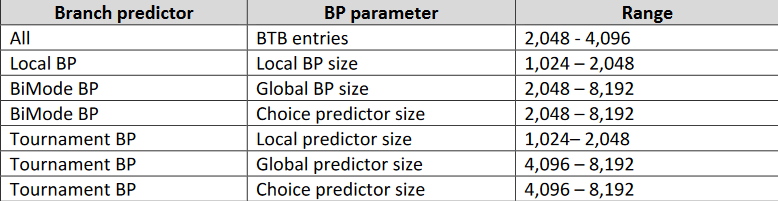
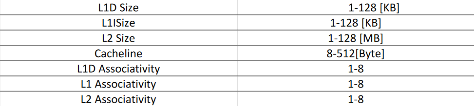

# Using GEM5 to Simulate and Analyze Different Configurations of Branch Predictors and Caches

## Navigate to either Branch-Predictors or Caches for a more detailed README.md

### Benchmarks Used: SPEC 456.hmmer and 458.sjeng

### Branch Predictor Config Combinations Explored

### Branch Predictor Exploration Results

To be added

### Cache Factors Explored

### Cache Exploration Results

To be added
